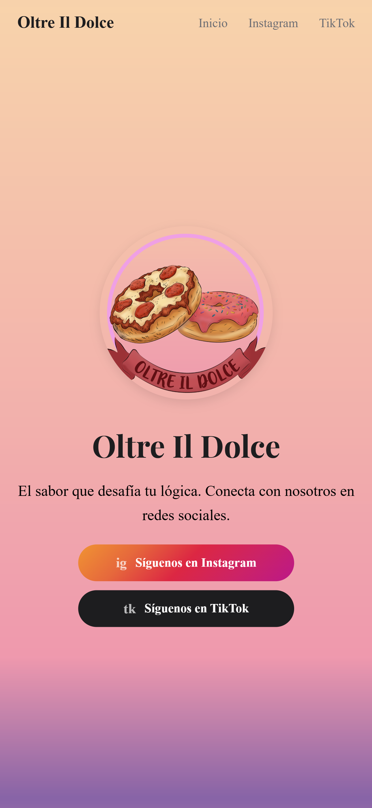
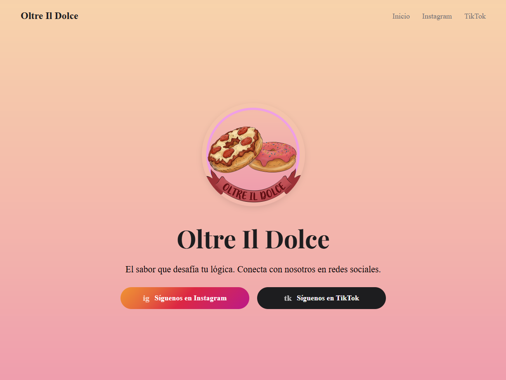

# 🚀 Mi Portafolio de Desarrollo - Yisusby02
¡Bienvenido! Aquí presento mis proyectos más destacados, donde combino diseño innovador y soluciones técnicas.
## 🍰 Oltre Il Dolce (Emprendimiento)
Una landing page diseñada para un negocio de donas con un enfoque innovador. El objetivo principal fue crear una experiencia visual atractiva y funcional.
### ✨ Lo más destacado:
* **Diseño Responsivo:** Adaptación total a dispositivos móviles para facilitar pedidos rápidos.
* **Optimización UI:** Interfaz limpia que prioriza la visualización de productos.
* **Innovación:** Estructura pensada para escalar el modelo de negocio.
### 📱 Vista Previa

| Versión Móvil | Versión de Escritorio |
| :--- | :--- |
|  |  |

---
## 📂 Otros Proyectos
### 🐍 File Sorter (Python)
Script automatizado que organiza archivos por extensión en carpetas específicas.
* **Tecnologías:** Python, OS, Shutil.
* [Ver repositorio del código](https://github.com/Yisusby02/File-Sorter)